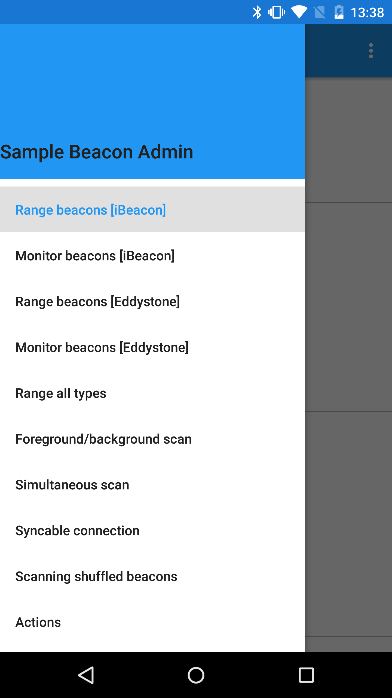
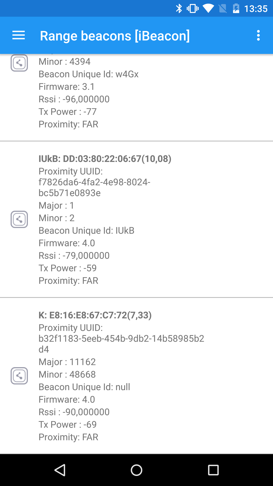
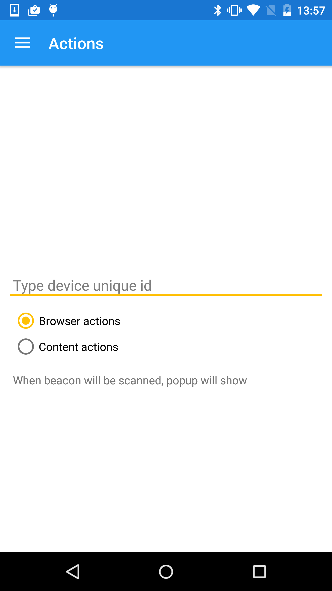
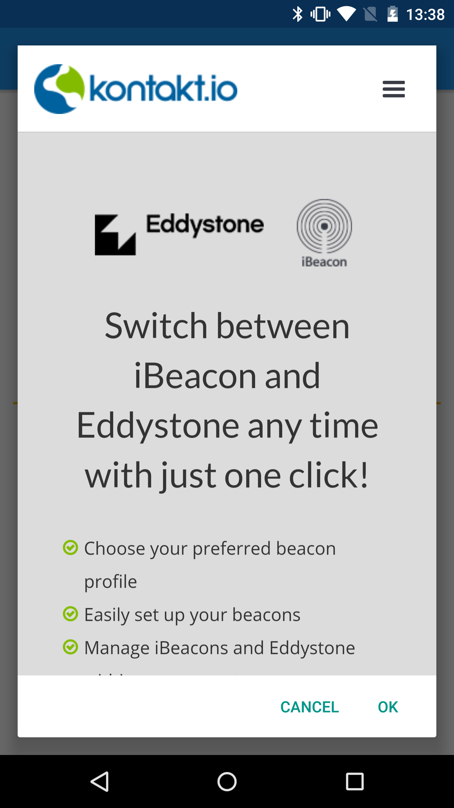

kontakt-beacon-admin-sample-app
===============================

Sample application demonstrating kontakt.io' Android SDK functionalities. The application comprises:
- Beacons ranging,
- Beacons monitoring,
- Beacons management
- kontakt.io's API Client usage.
- RxJava integration
- Scanning shuffled beacons
- Background scanning
- Actions
- Runtime permission managing

To be able to communicate with your account please change api-key value to yours api-key in <b>AndroidManifest.xml</b>
```
<meta-data
        android:name="kontakt.io.API_KEY"
        android:value="YOURS-API-KEY" />
```








For more information see: http://developer.kontakt.io/android-sdk/2.1.0/quickstart/


